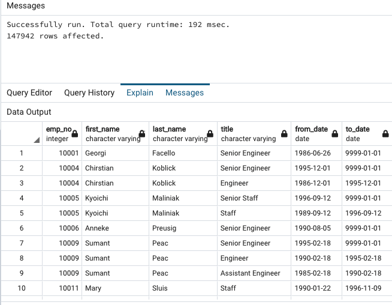
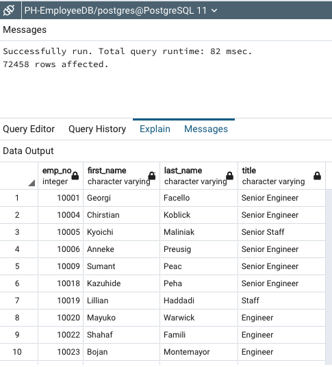
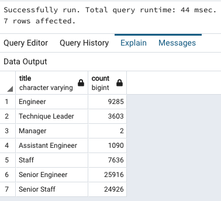
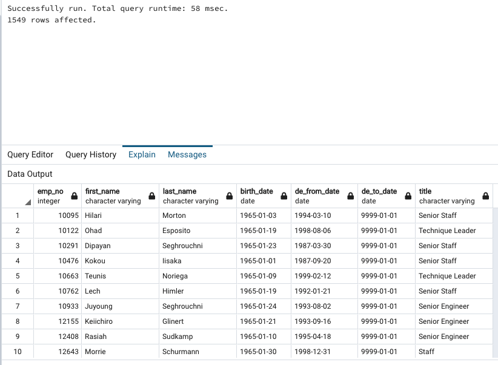
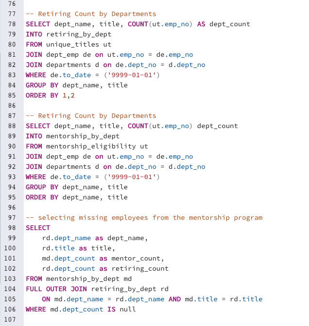
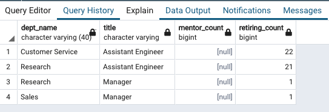

# Pewlett-Hackard-Analysis 

## Overview 
For our seventh data analysis project, we were given data files for Pewlett Hackard which contained information about the companies employees, departments, and managers.  Including information about salaries, hire dates, titles, etc.  We were tasked with creating a database to hold the information and they running an analysis from the information in the database.  We used PostgreSQL database, and the pgAdmin tool to manage the data. From the company data, we were tasked with pulling out a list of all the employees up for retirement, ensuring the list is unique, and getting counts by their titles.  Additionally, we were asked to pull out a list of employees for a mentoring program who were born in 1965.  
## Results

Provide a bulleted list with four major points from the two analysis deliverables. Use images as support where needed.

Deliverable 1:
- Created a table of all the employees and their titles that are eligible for retiring (Born between 1952 and 1955)
    - We joined the Employees and Titles tables 
    - We filtered out based on birtheday
    - file exported: retirement_titles.csv

 
- Filtered out duplicate employees due to multiple titles.
    - we used DISTINCT ON and order by to get a unique list.
    - use filtered out the employees that are no longer working by filtering on the to_date column.

 
- Using the unique titles table
    - we grouped on the titles to get the aggregate counts for each title that is retiring. 

 

Deliverable 2: 
- Using Employees, Department Employees, and Titles tables we produced the mentorship eligibility
    - Birthdate in 1965
    - to_date indicating that the employee is currently employed.
    - Used DISTINT ON and ORDER BY to make sure we got each employee once and the most current title.

 

## Summary
Looking at the retiring_titles list, which is the count of the employee's titles that are retiring soon, there are 7 roles that will need to be filled. Here they are listed: 

- Engineer
- Technique Leader
- Manager
- Assistant Engineer
- Staff
- Senior Engineer
- Senior Staff  

However, the titles alone were really not enough to know who was leaving.  I created three more queries so that I could get the aggregate counts for both groups on the the title and the department.  That way I could tell how many of each position were retiring from each department.  I created a second query to break out the group that is eligible for the mentorship program.  For both queries, I created two new tables.  "retiring_by_dept" and "mentorship_by_dept".  Then I joined them together on both title and department using a full outer join and filtered the result set where the mentors were null.  What I found was that there was for Department / titles where there was no one to mentor.  So there was enough people retiring, but there wasn't enough positions to mentor.  Perhaps filling those mentorship positions from people born in 1964 would fill the gap.  

 

 

Also, this additional analysis adjusts the projected roles that need to be filled.  When adding the department to the retiring count, there are 38 unique department/job titles retiring that will need to be filled.   

